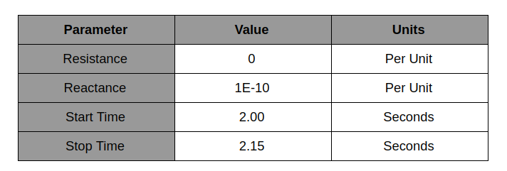
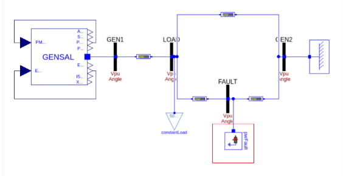
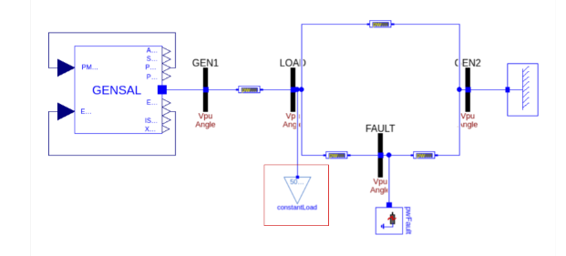
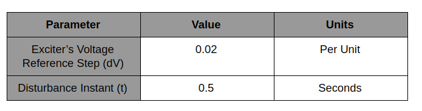
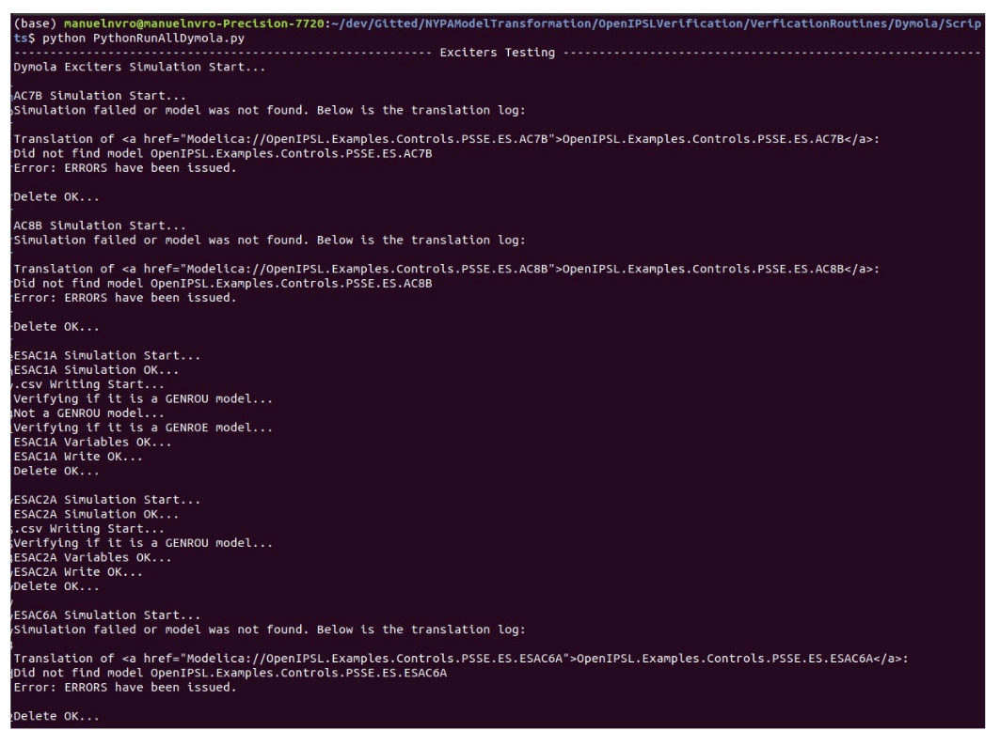

# Dymola Python Testing Scripts

This folder contains the Python scripts that will the Python scripts that verify the Dymola-developed OpenIPSL Modelica models against their PSS/E counter parts. The scripts have various options and all of the results are automatically outputted to the result directory.

## Folder Structure
This folder contains 3 main subfolders:
1. OpenIPSL - contains the latest version of the OpenIPSL library. 
2. Scripts - contains all of the '.py' scripts. 
3. WorkingDir - contains the results of the selected singals of the model in '.csv' file form.

## Scripts
The scripts are separated by the different tests performed: Fault, Load Variation, Reference Step. From there, each of the different model type has its own '.py' and '.ipynb' script. The Jupyter Notebooks were initialy created for development purposes. Now, the team only uses the '.py' scripts and the '.ipynb' scripts may be outdated. 

## Verification Tests Performed
There are three different tests that are performed on both PSS/E and Modelica. The one-line-diagram and specifications are outlined below:

- Fault - Three phase fault applied to the bus FAULT.  This test intends to check the dynamic behavior of the Modelica models against the reference models in PSS@E. The main idea is to verify the correspondence of the fast dynamics and non-linearities of the models between the two tools.

- Load Variation - Variation of the Load in the system at Load Bus. This test intends to verify the similar behavior between the models developed in Modelica and PSS@E focusing on testing the slow dynamics of the systems.

- Reference Step - Step in the Exciter voltage reference. The implementation of this test in Modelica has been performed by modifying the existing base class of the Exciter model. This test intends to validate the Modelica models against PSS@E checking the dynamic behavior, in particular in the saturation region of the components, that is determined by this type of event. 

## Auxiliary Models
The folder 'Auxiliary Models' [here](), has the purpose to change the SMIB model in order to be able to create the following two tests: Load Variation and Reference Step.

## How to run?
There are a few different scripts that can be run: 
1. [Dymola - Fault - Exciters](https://github.com/ALSETLab/NYPAModelTransformation/blob/master/OpenIPSLVerification/VerificationRoutines/Dymola/Scripts/Fault/FaultExcitersDymola.py).
2. [Dymola - Fault - Machines](https://github.com/ALSETLab/NYPAModelTransformation/blob/master/OpenIPSLVerification/VerificationRoutines/Dymola/Scripts/Fault/FaultMachinesDymola.py).
3. [Dymola - Fault - Power Systems Stabilizers](https://github.com/ALSETLab/NYPAModelTransformation/blob/master/OpenIPSLVerification/VerificationRoutines/Dymola/Scripts/Fault/FaultPowerSystemStabilizersDymola.py).
4. [Dymola - Fault - Turbine Governors](https://github.com/ALSETLab/NYPAModelTransformation/blob/master/OpenIPSLVerification/VerificationRoutines/Dymola/Scripts/Fault/FaultturbineGovernorsDymola.py).
5. [Dymola - Fault - Wind Turbines](https://github.com/ALSETLab/NYPAModelTransformation/blob/master/OpenIPSLVerification/VerificationRoutines/Dymola/Scripts/Fault/FaultwindTurbinessDymola.py).
6. [Dymola - Fault - All Models](https://github.com/ALSETLab/NYPAModelTransformation/blob/master/OpenIPSLVerification/VerificationRoutines/Dymola/Scripts/Fault/FaultRunAllDymola.py).
7. [Dymola - Load Variation - Exciters](https://github.com/ALSETLab/NYPAModelTransformation/blob/master/OpenIPSLVerification/VerificationRoutines/Dymola/Scripts/LoadVariation/LoadVariationExcitersDymola.py).
8. [Dymola - Load Variation - Machines](https://github.com/ALSETLab/NYPAModelTransformation/blob/master/OpenIPSLVerification/VerificationRoutines/Dymola/Scripts/LoadVariation/LoadVariationMachinesDymola.py).
9. [Dymola - Load Variation - Power Systems Stabilizers](https://github.com/ALSETLab/NYPAModelTransformation/blob/master/OpenIPSLVerification/VerificationRoutines/Dymola/Scripts/LoadVariation/LoadVariationPowerSystemsStabilizersDymola.py).
10. [Dymola - Load Variation - Turbine Governors](https://github.com/ALSETLab/NYPAModelTransformation/blob/master/OpenIPSLVerification/VerificationRoutines/Dymola/Scripts/LoadVariation/LoadVariationTurbineGovernorsDymola.py).
11. [Dymola - Load Variation - All Models](https://github.com/ALSETLab/NYPAModelTransformation/blob/master/OpenIPSLVerification/VerificationRoutines/Dymola/Scripts/LoadVariation/LoadVariationRunAllDymola.py).
12. [Dymola - Step Reference - Exciters](https://github.com/ALSETLab/NYPAModelTransformation/blob/master/OpenIPSLVerification/VerificationRoutines/Dymola/Scripts/ReferenceStep/ReferenceStepExcitersDymola.py).
13. [Dymola - Step Reference - All Models](https://github.com/ALSETLab/NYPAModelTransformation/blob/master/OpenIPSLVerification/VerificationRoutines/Dymola/Scripts/ReferenceStep/ReferenceStepRunAllDymola.py).
14. [Dymola - All Tests - All Models](https://github.com/ALSETLab/NYPAModelTransformation/blob/master/OpenIPSLVerification/VerificationRoutines/Dymola/Scripts/PythonRunAllDymola.py).

Once selected the appropiate script, you can:
	1. Use a Python IDE (PyCharm, Spyder, etc) and run the desired '.py' script. 
	2. User Terminal:
		1. Navigate to the desired script location (i.e. '../NYPAModelTransformation/OpenIPSLVerification/VerificationRoutines/Dymola/Scripts/Fault/..').
		2. Write the command: python FaultExcitersDymola.py
The terminal will display the progress of the process, the results will be outputted to the WorkingDir folder. 

## User Interface
The interface is a simple text based interface. However, it is really useful to diplay progres, and possible errors in verfications of the models. A sample interface is shown below;

## Results
All of the results can be found in the 'WorkingDir' folder. The results are separated by:
	- Tests - Fault, Load Variation, Reference Step.
		- Model Type - Exciters, Machines, etc.
Results are all time series of the selected variables that will be compared to PSS/E models in '.csv' file. 

## How to cusotmize?
In order to change the code here are a few examples:
	- Adding a new model:
	- Adding a new test:
	- Running a single model;
	- Keeping **all** of the restuls from the simulations (not just the '.csv' files).
	- Running a single model:

## Troubleshooting
Some of the most common issues are:
- The 'OpenIPSL folder cannot be found' - this can be fixed by creating a folder 'OpenIPSL' at this directory: '../NYPAModelTransformation/OpenIPSLVerification/VerificationRoutines/..'.
- 'Model error or not foud', this happens when a model is 

## Further Development
Further development of the scripts/verification routines can be done by creating an issue or pull request in the [GitHub](https://github.com/ALSETLab/NYPAModelTransformation) repository. 

## Notes
- This repository does **not** contain any of the Modelica models, they all come from the OpenIPSL library.
- OpenIPSL folder is updated **every** time that a verification script is run.
- Results folder is updated **every** time that a verification script is run.
- The scripts were run mostly on an Ubuntu 18.04 LTS machine.
- The scripts were run using latest version of OpenIPSL found [here](https://github.com/OpenIPSL/OpenIPSL).
- The scripts were run using Dymola version 2020x.
- The scripts were run using OpenModelica version 1.16.
- The scripts were run using Python 3.7.0. 
- Auxiliary models are Modelica models.
