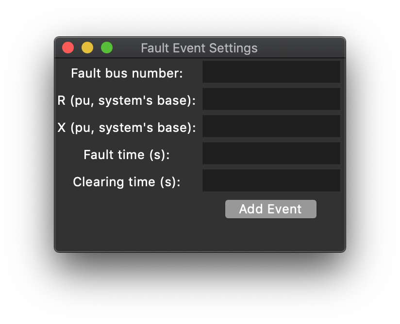

## Getting started

In order to work with the Tranlator Tool, the user needs to have a python 3 environment set up. Versions 3.7 and 3.9 were tested and the tool works fine on both. The tool was also tested in a Linux and in a Mac environment. The user should also install libraries such as:

- Pandas
- Numpy
- Tk 
- TLC

A more detailed guide can be found <a href="https://github.com/ALSETLab/NYPAModelTransformation/tree/master/ModelTransf-Tool">here</a>. The GUI can be started by using the following command in the tool's folder.

```
python3 main.py
```

Note: the python command may vary depending on version and on operative system, but when the appropriate command is used, the user should see the following widget window.


## Translation Using GUI

To start a translation, the user should go to the main window and find: File > New Translation > From PSS/E File. A new widget window will pop up and it should look like the following.


The first field should be filled with the path pointing to the RAW file, while the second field should point to the DYR file. Note that the user can look for the path using the button located to the right from the text-dedicated input space. The user can select the type of decoder used in parsers, which allows the tool to read files with special characters. The user should also select the directory where the translation will be saved and, finally, the user can also opt for the inclusion of a Fault event in the model. An example of a properly filled window is shown below.


If the user selects that they want to include a Fault Event in the model, a new widget window will pop up. It will look like the following image. 



There, the user can specify an integer that will be the bus number to which the fault will be connected. The user can also specify the real numbers R and X which represents the Fault's resistance and reactance un per units, calculated using the system base. Finally, the user should also specify when the fault will start and when it will be cleared. This information is mapped into an instantiation of a Fault element available in the OpenIPSL. An example of a properly filled window is shown below. After filling the information, the user can press 'Add Event'.


If all the information is correctly loaded into the tool, the user can press 'Start Translation'. Some messages may appear in the command window from where the tool was launched and the user can check them in order to find inconsistencies in their original model or malfuctions in the translation procedure. A successful translation will result in a pop up window showing the some information of the system, such as PSSE version, system base power and system base frequency. The window is displayed below. 


## Translation Using Functions

The tool can also be used via python scripts. This allows the tool to be the process performed by the tool to be automated and integrated into workflows. An example of a script that will allow the translation of the ESAC1A test system, available in the examples folder is displayed below.

```python
# ----- Importing sys module:
import sys, os, time
homedir= os.getcwd()
# ----- Tool path:
tooldir = "/Python_OpenIPSL" # THIS IS AN EXAMPLE NAME
# ----- Adding paths for new modules:
srcdir = homedir + tooldir + "/src"
auxdir = homedir + tooldir + "/fcn"
sys.path.insert(1, srcdir)
sys.path.insert(2, auxdir)
# ----- Importing auxiliary functions:
import directory_functions
import psse2mo
# ----- Determine path for RAW and DYR files:
rawfile = homedir + tooldir + "/examples/smib/Exciters/ESAC1A/smib_esac1a.raw"
dyrfile = homedir + tooldir + "/examples/smib/Exciters/ESAC1A/smib_esac1a.dyr"
# ----- Determine the encoding reader (0 - utf8, 1 - latin1):
encode_flag = 0
# ----- Getting info from RAW:
start_readraw = time.time() # initial time for raw.
[system_base,system_frequency,sysdata,psse_version] = psse2mo.readRaw(rawfile,encode_flag) # parse and format rawfile for sysdata
time_readraw = time.time() - start_readraw # time for raw.
# ----- Getting info from DYR:
start_readdyr = time.time() # initial time for dyr.
dyrdata = psse2mo.readDyr(dyrfile) # parse info from dyrfile
time_readdyr = time.time() - start_readdyr # time for dyr.
# ----- Determine directory to which translation should be directed:
userpath = homedir
# ----- Determine fault and Fault Info (0 - no fault, 1 - include fault):
fault_flag = 1
#      [bus number, R, X, T_start, T_end]
faultinfo = [22,0.0,0.0,2.0,2.15]
# ----- Write translation:
start_trans = time.time() # initial time.
[wdir,sdir,ddir,gdir] = directory_functions.createDir(userpath) # creates folders for placement of results   
psse2mo.writeMo(wdir,sdir,ddir,gdir,system_base,system_frequency,sysdata,dyrdata,fault_flag,faultinfo) # writes models
time_trans = time.time()- start_trans # calculate execution time
# ----- Updating parameters and writing log:
total_time = time_trans + time_readraw + time_readdyr
times = [time_readraw,time_readdyr,time_trans,total_time]
psse2mo.writeLog(wdir,system_base,system_frequency,psse_version,sysdata,dyrdata,times,fault_flag,faultinfo) 

```

## Simulation Results

After executing a tranlation, it is possible to load the translated model in Modelica-compliant tools such as Dymola and perform a simulation. The user must first load the most recent version of OpenIPSL into Dymola (or another Modelica-compliant software). Below, you will find the result comparison between the example ESAC1A which was atuomatically translated with the built-in example from OpenIPSL. Recall that the built-in test system was verified against PSSE. Note that there is a 1-to-1 match for the curve.


## FMU and Real Time Simulation

The translated model can be loaded into Modelica and exported as an FMU. The FMU, then, can be loaded into many other tools such as Simulink and dSPACE's ConfigurationDesk. The FMU can also be simulated using python libraries such as FMPy and PyFMU. Below you can find images of the simulation of a translated FMU in real time using dSPACE's ConfigurationDesk and the Real Time Simulator SCALEXIO. The first image shows the voltage magnitude on the load bus, while in the second figure you can find the electrical power being generated by the machine. The event at 2.0s is a Fault, just like the one presented in this guide. The resuts refer to a PSS2A test system.


<a href="./index">Go back</a> 