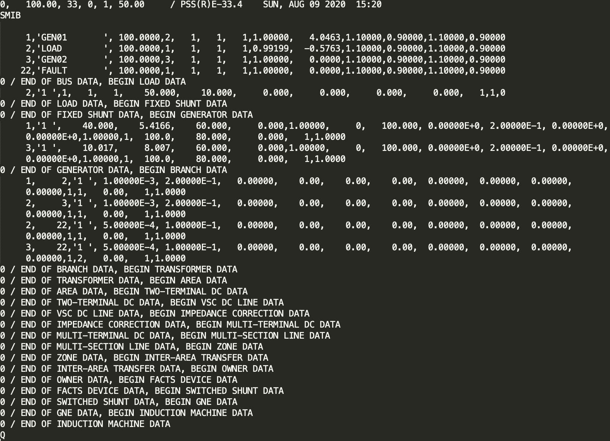
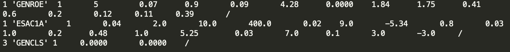
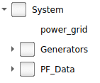
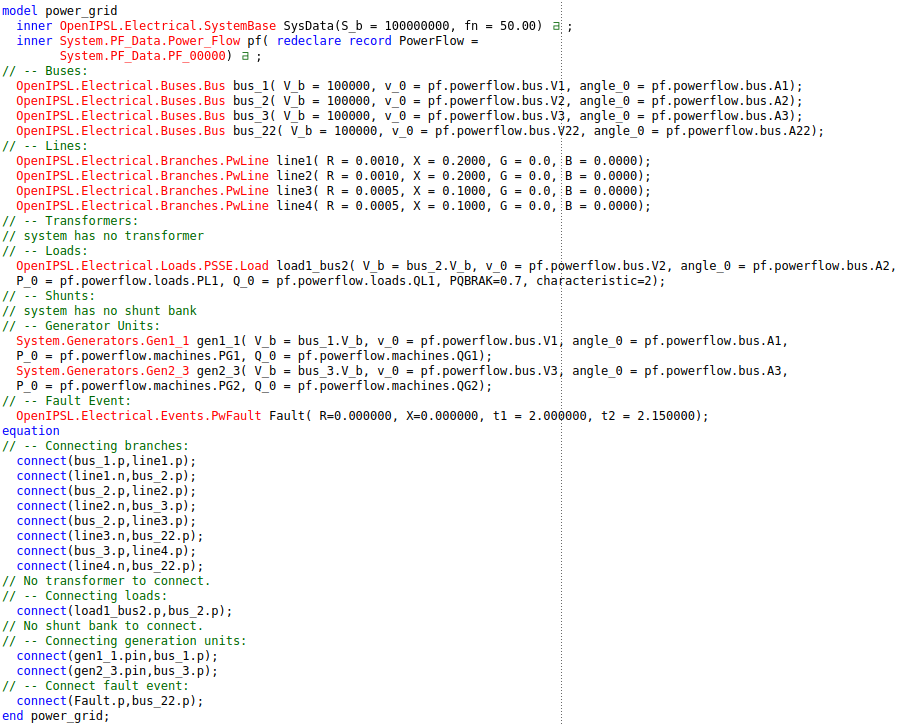
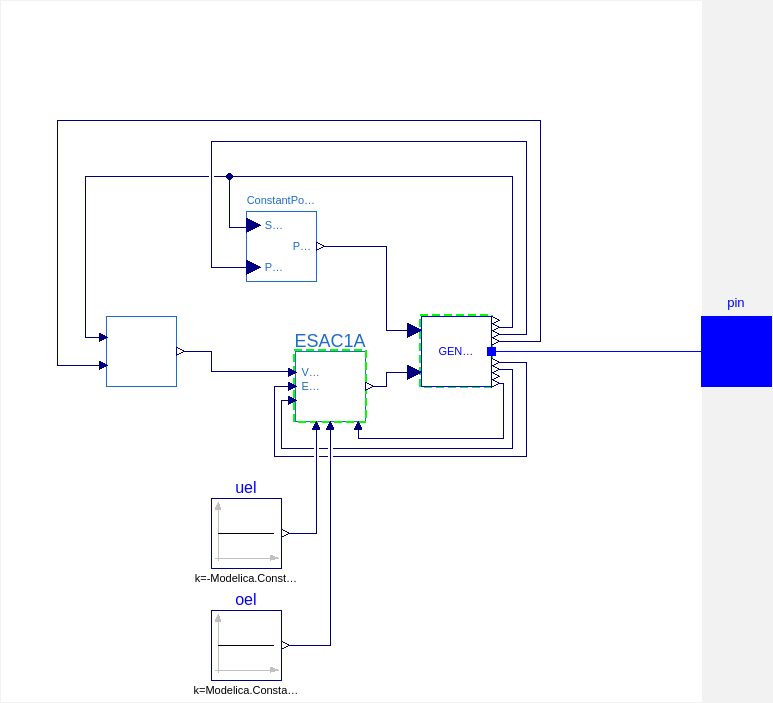
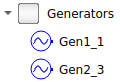
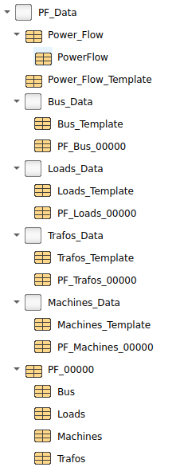

## Introduction

The Model Transformation Tool prototype work as a way of translating PSSE files into Modelica models using the Open Instance Power Systems Library, or <a href="https://github.com/OpenIPSL/OpenIPSL">OpenIPSL</a>. Models in PSSE are, mainly, described by two files: RAW file and DYR file, while in Modelica one file could be used to represent everything. However, the Model Transformation Tool uses a modular structure, taking advantage of the object-oriented feature of Modelica and making it possible for the user to edit the target model after the translation is done. 

## PSSE Representation

A RAW file will contain the information about the network being represented, its buses, lines, transformers, generation plants, loads and banks. A RAW file is supposed to contain all the information needed for a Power Flow (PF) calculation. The PF is the solution of a non-linear set of algebraic equations that finds an equilibrium of the system, where the total power being generated matches the power being consumed by all the devices in the grid plus the losses present in the system at a determined instant. This information is used in many different studies in the power system but here this information is used to create an equilibrium from which the dynamic system can start, so simulation starts appropriately whithout any undesired transient behavior.

The DYR file, on the other hand, contains information about the dynamic models being used to represent the devices used in each generation unit of the system. It is basically a list of models representing such devices, a set of integer numbers representing the bus to which that model is connected to and specifications related to connection of determined signals, and a set of real numbers that represnts the parameters used in each model.

## The Translation

Combining the information from these two files, it is possible to create a Modelica representation of the system, using the OpenIPSL. Of course, the representation will be limited by the model coverage from OpenIPSL. If the models from the PSSE file are available in OpenIPSL, the transformation tool can be successfully used. 

The translator parses the information from the RAW and DYR files that are taken as inputs. Then, the information is mapped into the Modelica representation, using python functions that write OpenIPSL's models instantiations based on identification of components in the PSSE files. For example, if the RAW file shows a line connecting two buses, the transator should instantiate the two buses, the line model, and then perform the connection between these elements.

Python functions are also the responsible for scanning the DYR file, identifying what models are used, if they have corresponding OpenIPSL representations and how each dynamic model is connected within each generation unit. These machines are written using a template approach that is better expemplified <a href="./guide">here</a>. The output Modelica representation also follows a template that is described below.

## Modelica Representation

The Modelica representation will be mainly composed by three structures: the grid model, generator's package and a record package. The package's structure is shown in the figure below.

The power grid model, as it suggests, is a representation of the grid itself and it contains the instantiation of the passive components of the grid, such as buses, branches, banks and loads, the way these elements are connected and, finally, the instantiation of the collection of generating units (generators). Basically all the information used to create the power grid model file comes from the RAW file. The information contained in the network is presented in the figure below. Note that many instantiations do not have an annotation, meaning that there's no icon on the diagram view and the model is basically text-based, with the exception of the machines.

The generation units are defined in the generator's package. There, each generation unit is declared as an individual model with a specific set of parameters and a particular connection setting. These models are instantiated in the power grid model and they are connected in the appropriate bus as specified in the DYR file. In fact, almost all the information from each model present in the generator's package comes from the DYR file. The representation of the generation unit connected to bus 1 of the simple test system shown in the PSSE files above is depicted below. Note that all connections are represented graphically as well, facilitating the manipulation by the user.

All generators are grouped in the Generators package, which is shown below. In this simple example there are only two generation units and, therefore, there are only two models withing the Generator's package.

Last but not least comes the record package, which is used as a repository of information related to the power flow solution. It contains voltage magnitudes and angles for every and each bus, active and reactive powers being generated by each generation unit and being consumed by each load, and, finally, the tap configuration from each transformer in the system. This set of information is loaded by the power grid model using the record feature from Modelica and, therefore, the user can set easily set different operation points to which the model will be initialized in order to perform a simulation representing a specific scenario. The representation of the record's package is shown below.

<a href="./index">Go back</a> 